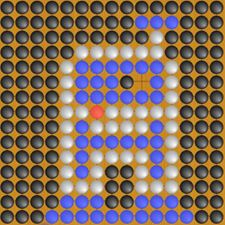

## Go Stone Art

### Privacy Policy

Go Stone Art is a simple iOS app, intended as casual entertainment for children. It does not ask you or your child for any personal information nor collect any personal information. Appamajigger cannot look at nor collect any pictures drawn in Go Stone Art.

Go Stone Art does collect information for purposes of app maintenance and bug fixing, such as your device type, iOS version, and crash data. This information is collected via Apple-provided mechanisms that are built into the App Store. Apple ensures that this type of information is anonymous and cannot be traced back to you. For more information on how you can control iOS's sharing diagnostic information, such as crash data, with app developers, see: <https://support.apple.com/en-us/HT202100>

*Updated December 17th, 2019 [v1.0.0]*

### Gallery

Send us your pictures at PUT EMAIL ADDRESS HERE and we'll post them here!

Looks like we have some Star Wars fans:

### GitHub Repository

The source files for the Go Stone Art app are located in a public GitHub repository: <https://github.com/mvlaursen/StoneArt>
(Note that https://github.com/mvlaursen/GoStoneArt is the GitHub repository for this web page, not the app.)
